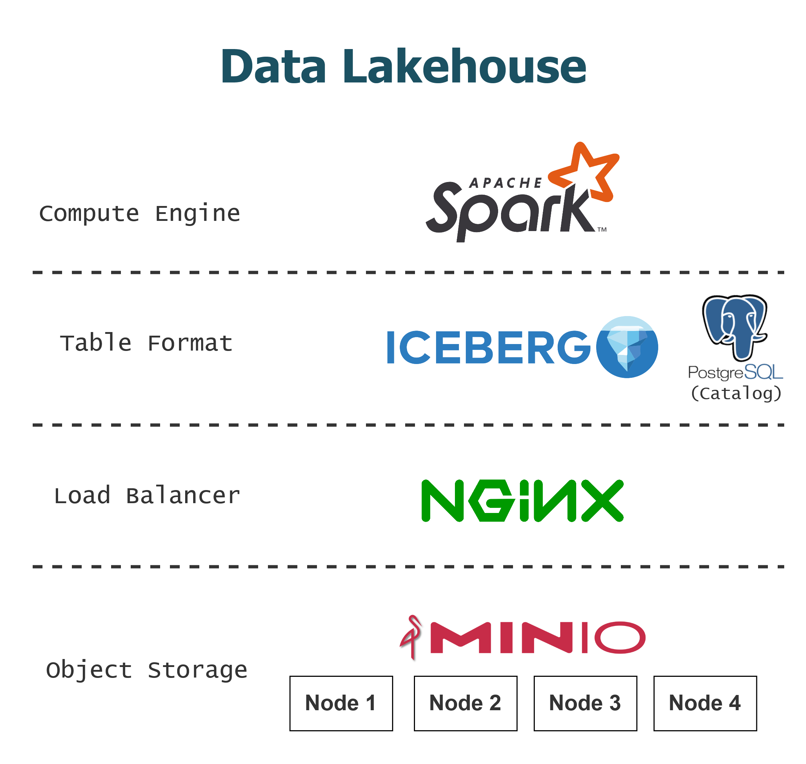

# Docker Iceberg Lakehouse

This repository demonstrates the deployment of a **Modern Data Lakehouse** using a containerized architecture. It provides ACID transactions and scalable metadata management for big data workloads.
It is an enhanced evolution of the [databricks/docker-spark-iceberg](https://github.com/databricks/docker-spark-iceberg/tree/main). To better simulate an enterprise environment, the architecture has been enhanced:
- **High Availability Storage**: Replaced the single-node MinIO setup with a 4-node distributed MinIO cluster to achieve data redundancy and horizontal scalability.
- **Load Balancing**: Nginx as load balancer to manage API and console traffic across the MinIO cluster.
- **Persistent Catalog**: Transitioned from a simple REST catalog to a PostgreSQL JDBC Catalog, ensuring metadata persistence and ACID transaction integrity.

---

## Architecture


## Environment

- OS: Ubuntu Server 22.04 LTS
- Docker Compose: v2.26.1
- Image tag
  - postgresql: postgres:16-alpine
  - spark-iceberg:
  - minio: RELEASE.2025-09-07T16-13-09Z
  - nginx: 1.29.2
  - mc:

## Directory Structure

```
docker-spark-iceberg
├── data
├── postgresql
├── spark
│   ├── ipython
│   ├── notebooks
│   ├── scripts
│   ├── .pyiceberg.yaml
│   ├── Dockerfile
│   ├── entrypoint.sh
│   ├── requirements.txt
│   └── spark-defaults.conf
├── .env.example
├── docker-compose.yaml
├── nginx.conf
└── README.md
```

## Usage Steps

1. Create sub-directory:
    ```bash
    mkdir -p data/minio{1..4}/data{1..2}
    mkdir postgresql/data
    ```

2. Edit `.env`: Set your own username, password, and url.

3. Start containers: `docker compose up -d --build`

4. Access the console:
   - Jupyter Notebook: `http://localhost:8888`
   - MinIO Console: `http://localhost:9001`
   - Spark UI: `http://localhost:8080`

5. Access the CLI:
   - Spark SQL: `docker exec -it spark-iceberg spark-sql`
   - PySpark: `docker exec -it spark-iceberg pyspark`
   - Scala: `docker exec -it spark-iceberg spark-shell`

6. To stop and remove all containers: `docker compose down`